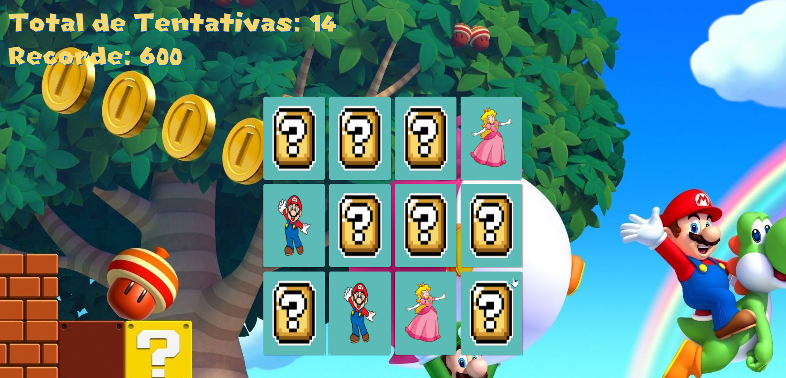
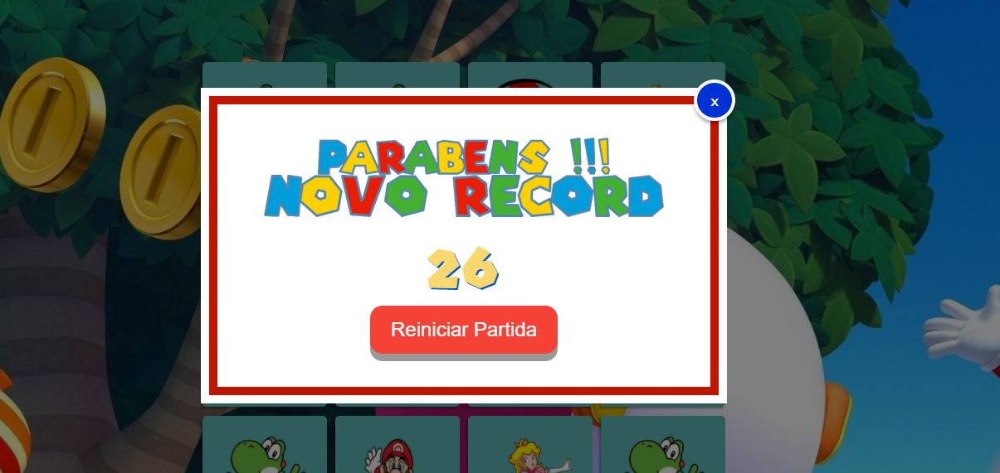

 


## ❔ Sobre o Projeto
Este é um jogo da memória composto pelos personagem do game Super Mario.

## 🧐 Motivo
Com o desenvolvimento do projeto, foi possível desenvolver conseitos importantes de CSS e HTML e JavaScript a fim de criar animações para o jogo.

## 📸 Screenshots
#### Tela Inicial


#### Recorte do Jogo



#### Tela Final


## ⚙ Instalação  
se quiser baixar e rodar na sua máquina, clone o repositório comgit clone 
clone ```https://github.com/IsraelJulio/Game-Jogo-da-Memoria.git```

E acesse o arquivo index.html no seu navegador favorito!


## 🐛 Issues
Sinta-se à vontade para registrar um novo problema com o respectivo título e descrição no repositório. Se você já encontrou uma solução para seu problema, adoraria revisar sua solicitação de pull!

## 🤝 Contribuições
Siga os passos abaixo para contribuir:

1. Faça o *fork* do projeto (<https://github.com/IsraelJulio/Game-Jogo-da-Memoria/.git>)

2. Clone o seu *fork* para sua maquína (`git clone https://github.com/user_name/REPO_NAME.git`)

3. Crie uma *branch* para realizar sua modificação (`git checkout -b feature/name_new_feature`)

4. Adicione suas modificações e faça o *commit* (`git commit -m "Descreva sua modificação"`)

5. *Push* (`git push origin feature/name_new_feature`)

6. Crie um novo *Pull Request*

7. Pronto, agora só aguardar a análise 


Made with ♥ by Israel Julio

Gostou? Deixe uma estrelinha para ajudar o projeto ⭐
